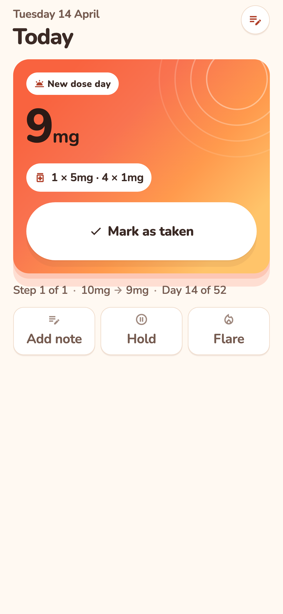
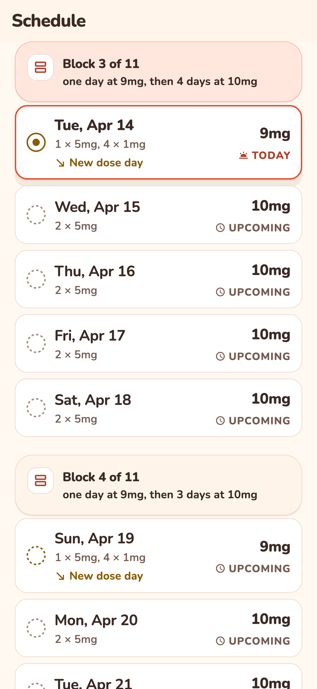
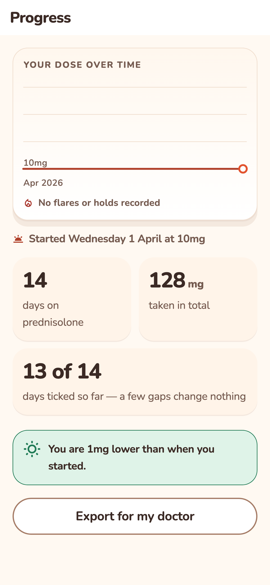
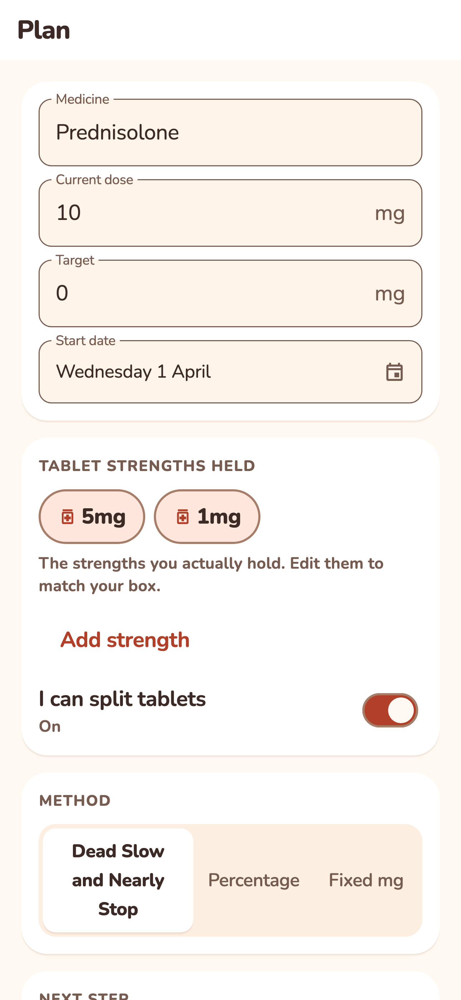

<div align="center">


# NearlyStop

**An offline, account-free planner for an alternating-day steroid taper.**

[](https://github.com/zakariaf/NearlyStop/actions/workflows/ci.yml)


</div>

---

People with polymyalgia rheumatica or giant cell arteritis taper prednisolone
over **two to five years**. The safe community method — *"Dead Slow and Nearly
Stop"* — is not "take 1mg less". It is an eleven-block calendar in which the new
dose arrives on progressively closer days, runs **52 days for a single 1mg
step**, and deliberately ignores that a week has seven days in it. Then each
day's dose has to be built out of the tablets you actually hold: 6.5mg is one
5mg + one 1mg + half a 1mg.

Patients try to map a 52-day non-weekly pattern onto a wall calendar, lose their
place, and cut too fast — which causes a flare that costs months. The most-asked
question in their forum is *"what's happening on the other 4 days?"*, and a
moderator's standing answer is: **"Forget 7 days in the week."**

That sentence is the product. NearlyStop arranges the plan the patient and their
doctor already agreed, and tells them what to swallow this morning.

> **It never recommends a dose.** The app arranges; the clinician decides.

Users are overwhelmingly **60–80 years old** and open this app every morning for
roughly **780 days**. It is designed for the thousandth open, not the first.

## What it looks like

<table>
  <tr>
    <td width="25%"></td>
    <td width="25%"></td>
    <td width="25%"></td>
    <td width="25%"></td>
  </tr>
  <tr>
    <td align="center"><b>Today</b><br>the one number, and the tablets it is made from</td>
    <td align="center"><b>Schedule</b><br>grouped by block — never a seven-column grid</td>
    <td align="center"><b>Progress</b><br>the staircase down, flares and holds marked</td>
    <td align="center"><b>Plan</b><br>your tablet strengths, your agreed step</td>
  </tr>
</table>

The **Schedule is never a month grid.** A seven-column calendar re-creates
exactly the confusion the app exists to remove, so block grouping is the
teaching device and a test fails the build if a `GridView` ever appears there.

## Non-negotiables

| Rule | Why |
|---|---|
| 100% offline, no account, no server, no sync | The account is the documented failure mode of the main competitor |
| No drug database | The user picks their own tablet strengths from a list they edit |
| Never recommends a dose | The legal and ethical line |
| Local notifications only | No push infrastructure |
| No LLM, **zero network calls of any kind** | Deterministic arithmetic |
| Data must survive app updates | These plans run for years; losing one is the worst possible bug |
| Never round a dose silently | An unachievable dose is flagged. This is the one unforgivable bug |
| Accessibility is correctness | The audience is overwhelmingly 60–80 years old |

## Zero network calls, proved four ways

Not one check — four, because any single one is a claim about what somebody
remembered to look at.

| Layer | What |
|---|---|
| **Static** | `package:http`, `dio`, `google_fonts`, `HttpClient`, `Socket`, `WebSocket` banned anywhere under `lib/`, each with a fixture that must fail |
| **Dependency** | The *resolved* tree, not the pubspec — a banned package three hops down fails the build |
| **Runtime** | Every `HttpClient` the process can create is made to throw, then all six screens are driven in two languages |
| **Manifest** | `INTERNET` absent from the release Android manifest — a network call is not merely absent, it is *impossible* |

Fonts are bundled, never fetched. There is no analytics SDK, no crash reporter,
no telemetry. The claim is re-verified in airplane mode from a clean install
before every release.

One link leaves the app, at your tap: **Settings → Open source** hands this
repository's URL to your browser. It carries nothing but the URL, and it exists
because a negative claim cannot be demonstrated by the app making it — you can
read the code instead of trusting it.

## Languages

| Direction | Locales |
|---|---|
| Left to right | English `en`, German `de` |
| Right to left | Persian `fa`, Kurdish Sorani `ckb` |

Each locale gets its own numerals and its own date formats. Persian gets the
Jalali calendar; **Kurdish Sorani deliberately does not** — most Sorani speakers
are in Iraqi Kurdistan and use the Gregorian calendar, so a Jalali date would be
wrong rather than merely unidiomatic. `ckb` has no `intl` date symbols at all,
so its weekday and month names are carried in the app's own ARB and its digits
come from the Persian number formatter.

`flutter_localizations` ships 116 locales and Kurdish Sorani is not one of them,
so the app supplies its own Material, Cupertino and Widgets delegates for it.

## Accessibility

The audience makes this correctness rather than polish. Every screen is verified
at the largest OS text size without clipping, WCAG AA contrast is asserted by
test, tap targets are ≥44pt (the daily action is 88), no state is signalled by
colour alone, and reduced-motion collapses every animation to zero.

## Run it

```bash
flutter pub get
flutter run
```

## Test it

```bash
flutter test
```

2400+ tests, plus 19 gate scripts. Nine of them carry a self-test that asserts
*both* arms — a fixture that must fail and one that must not — because a rule
which has never matched anything is a rule with a typo in it. The full pre-PR
sequence is in [`CONTRIBUTING.md`](CONTRIBUTING.md).

## Where things are

| Path | What |
|---|---|
| `SPEC.md` | The product spec: domain rules, screens, data model, edge cases |
| `epics/` | The 15-epic implementation plan; `CONTRACTS.md` is the arbiter |
| `design/` | The Daybreak design system and the reference screenshots |
| `.claude/skills/` | 44 skills — the conventions this repo is built to |
| `lib/core/` | Pure Dart: no Flutter, no Riverpod, no drift. Gated |
| `tool/` | 19 gate scripts; nine carry a self-test asserting both arms |

Built with Flutter 3.44 · Riverpod 3 · drift · go_router · Material 3.
The schedule is a **pure function**, never stored: facts are persisted (plan,
steps, dose logs, flares, holds) and `generateSchedule(...)` derives the rest,
which is what makes rolling back a flare incapable of corrupting history.

Application id / bundle id: `com.buzzjective.nearlystop`. Android and iOS only.

## Licence

**Not yet chosen.** The repository is public and the code is readable by anyone,
but without a licence file the default is all-rights-reserved — so this is not
yet open source in the sense that lets you fork or reuse it. A licence is the
next thing to add here.

## This is not medical advice

NearlyStop arranges a plan you and your doctor already agreed. It does not give
medical advice and it never decides a dose. Always follow your doctor's
instructions.
